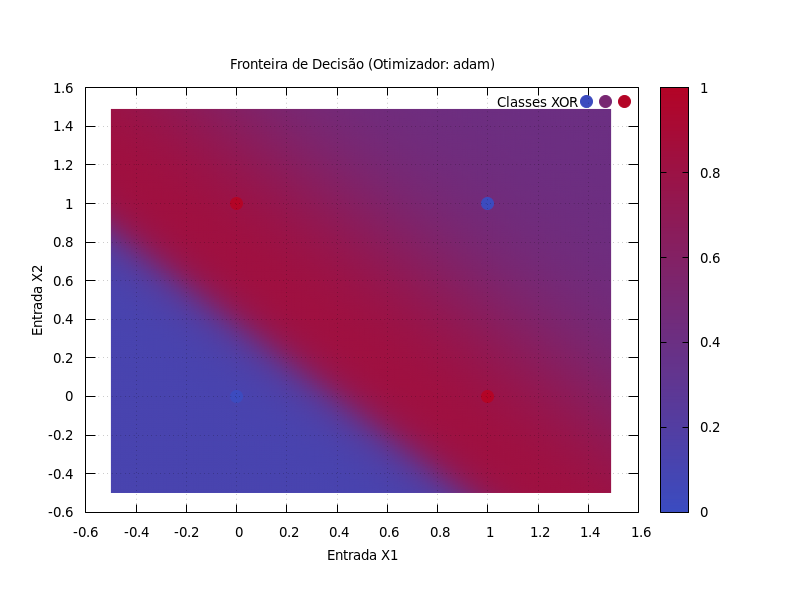

# MLP-Lua-FromScratch (BossaNet)

Mini-framework de MLP construído do zero em Lua. Inclui backpropagation manual, otimizadores (SGD/Adam), funções de ativação selecionáveis e visualização com Gnuplot.



## 📖 Sobre o Projeto

Este projeto nasceu a partir de um exercício acadêmico para a disciplina de Sistemas Inteligentes 2, que propunha a implementação de uma Rede Neural (MLP) para resolver o problema do XOR. O desafio foi levado um passo adiante: em vez de usar bibliotecas prontas, todo o sistema foi construído do zero (from scratch) em Lua, para aprofundar o entendimento sobre os fundamentos matemáticos e algorítmicos do Deep Learning.

O que começou como um simples script evoluiu para um mini-framework modular, flexível e experimental, demonstrando não apenas a solução do problema, mas também o processo realista de engenharia, depuração e otimização de um modelo de Machine Learning.

## ✨ Features Principais

* **Construção do Zero (From Scratch):** Nenhuma biblioteca de Machine Learning foi utilizada.
    * **`matlib.lua`**: Uma biblioteca de álgebra linear para operações com matrizes e vetores, criada especificamente para este projeto.
    * **`neural_net.lua`**: Um motor de treinamento que implementa manualmente o backpropagation.
    * **`plotlib.lua`**: Uma biblioteca de visualização que gera scripts e renderiza gráficos através de uma interface com o Gnuplot.
* **Motor de Rede Neural Modular:** O código é organizado de forma que o motor de treinamento seja agnóstico à visualização e à configuração do experimento.
* **Otimizadores Selecionáveis:**
Suas opções são:
    * Gradiente Descendente Estocástico (SGD)
    * Adam
* **Funções de Ativação Flexíveis:** Suporte para múltiplas funções de ativação, também selecionáveis por parâmetro:
    * Sigmoide
    * Tangente Hiperbólica (Cúbica Suavizada)
    * Funções alternativas ("cubic" = x³+0.5, função utilizada no execício original)
* **Técnicas Avançadas de Treinamento:**
    * **Parada Antecipada (Early Stopping):** O treinamento é interrompido automaticamente quando a acurácia de 100% é atingida.
    * **Corte de Gradiente (Gradient Clipping):** Implementado para previnir o problema de explosão de gradientes.
* **Interface de Treinamento Profissional:** A saída do terminal exibe uma barra de progresso, perda (loss) e acurácia a cada época, simulando o comportamento de frameworks como Keras/TensorFlow.

## 🚀 Como Executar

### Pré-requisitos

Você precisará ter o **Lua** e o **Gnuplot** instalados e acessíveis no seu sistema.

```bash
# Para sistemas baseados em Debian/Ubuntu
sudo apt-get update
sudo apt-get install lua5.4 gnuplot